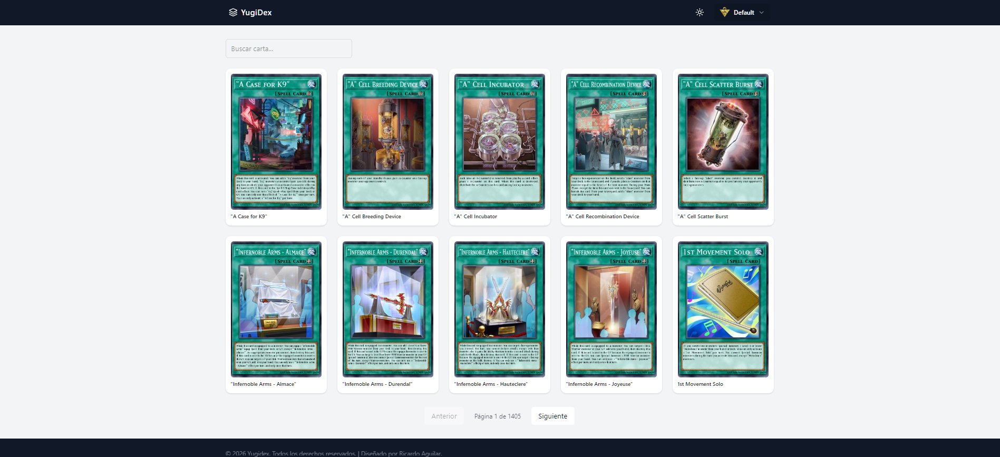
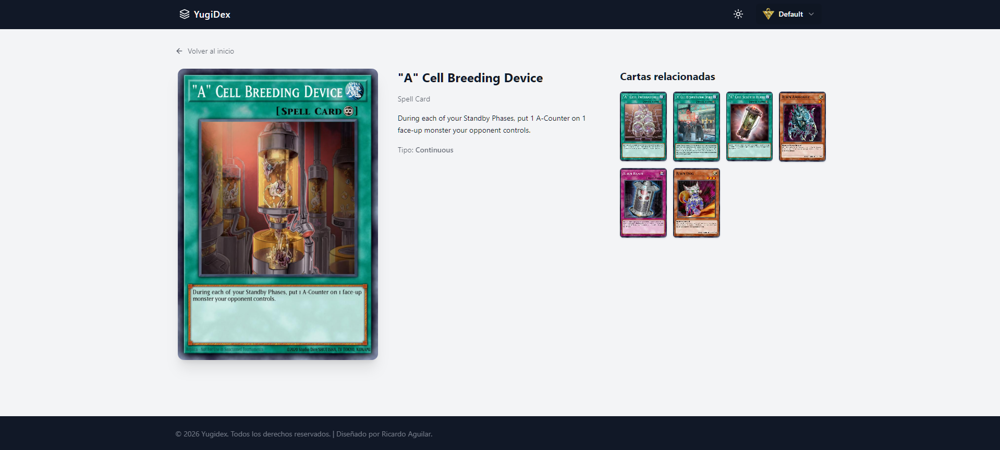
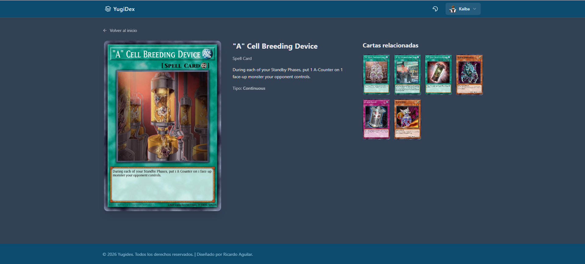

## YugiDex — Yu-Gi-Oh! Card Explorer

YugiDex es una aplicación web moderna para explorar cartas de Yu-Gi-Oh!, construida con Angular 21, Tailwind CSS v4 y la API oficial de YGOPRODeck.
Permite buscar, filtrar y visualizar cartas con un diseño inspirado en productos reales, incluyendo vista de detalle, cartas relacionadas y soporte para modo claro / oscuro.

## Características principales

-Búsqueda de cartas en tiempo real
-Listado paginado con skeleton loading
-Detalle de carta con información completa
-Cartas relacionadas por arquetipo, tipo y raza
-Modo claro / oscuro persistente
-Theming dinámico (Yugi, Kaiba, Atem)
-Skeleton loaders para mejor UX
-Diseño responsive (mobile-first)

## Tecnologías utilizadas

-Angular 20 (standalone components)
-TypeScript
-Tailwind CSS v4
-YGOPRODeck API
-Lucide Icons
-RxJS
-LocalStorage (persistencia de tema)

## Demo

https://yugiodex.netlify.app/

## Screenshots

### Listado de cartas

### Detalle de carta

### Modo oscuro

## Instalación y uso local

### Clonar el repositorio

git clone https://github.com/rjar86/app-yugidex.git
cd app-yugidex

### Instalar dependencias

npm install

### Ejecutar en desarrollo

ng serve

### Abrir en el navegador:

http://localhost:4200

## Estructura del proyecto (resumen)

.
├─ screenshots/ # Capturas usadas en el README
│
├─ src/
│ ├─ app/
│ │ ├─ core/
│ │ │ ├─ models/ # Modelos de dominio (YugiohCard, etc.)
│ │ │ ├─ service/ # Servicios base / API
│ │ │ └─ theme/ # Configuración y lógica de temas
│ │ │
│ │ ├─ layout/
│ │ │ ├─ navbar/ # Navbar principal
│ │ │ ├─ footer/ # Footer
│ │ │ ├─ layout.html # Layout base
│ │ │ └─ layout.ts
│ │ │
│ │ ├─ pages/
│ │ │ ├─ cards/ # Listado de cartas
│ │ │ └─ cards-detail/# Detalle de carta
│ │ │
│ │ └─ index.html
│ │
│ ├─ main.ts
│ └─ styles.css # Tailwind CSS v4 + tokens de tema
│

## API utilizada

YGOPRODeck API
https://ygoprodeck.com/api-guide/

Ejemplo de endpoint usado:

https://db.ygoprodeck.com/api/v7/cardinfo.php

## Sistema de temas

La app incluye un sistema de temas dinámico:

-Default
-Yugi
-Kaiba
-Atem

Cada tema controla:
-Navbar
-Cards
-Fondo
-Colores en light / dark

El estado del tema y del modo oscuro se guarda en localStorage.

## Estado del proyecto

-Funcional
-En mejora continua
-Pensado como demo profesional / portfolio

## Licencia

Este proyecto es solo con fines educativos y demostrativos.
Yu-Gi-Oh! y sus imágenes pertenecen a Konami.

## Autor

-Ricardo Aguilar
-Fullstack Developer
-Portfolio: https://rjarportafolio.netlify.app/
-LinkedIn: https://www.linkedin.com/in/ingrjar86/
-GitHub: https://github.com/rjar86
